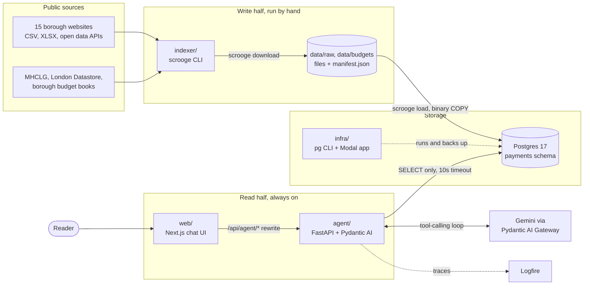
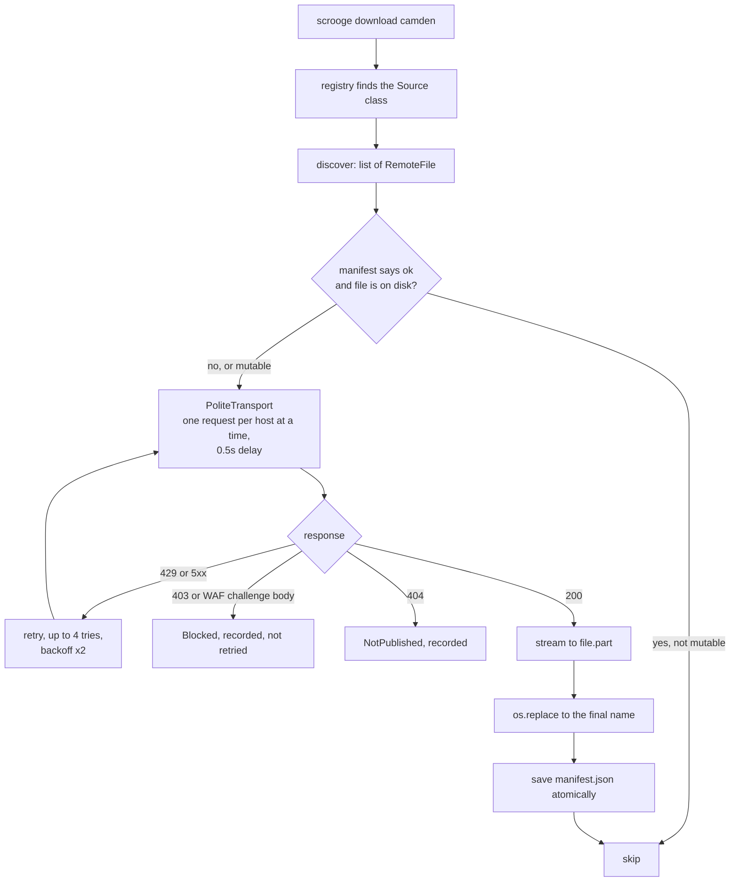
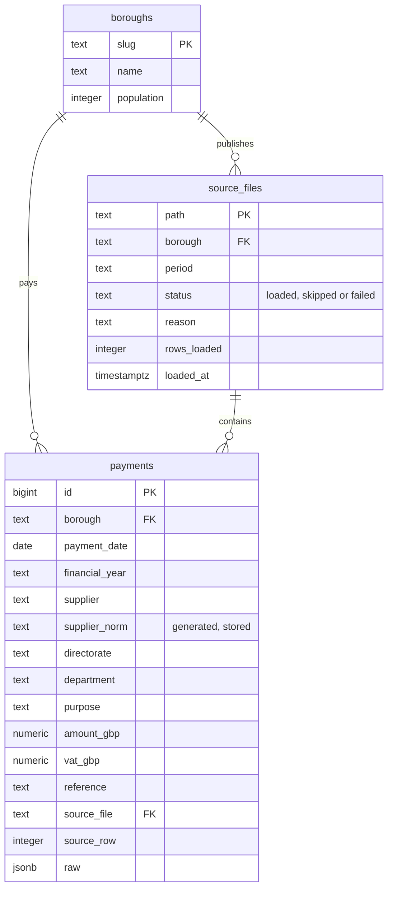
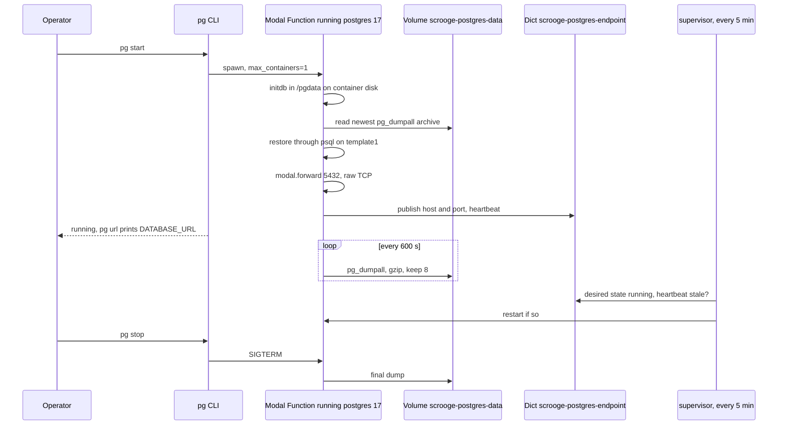
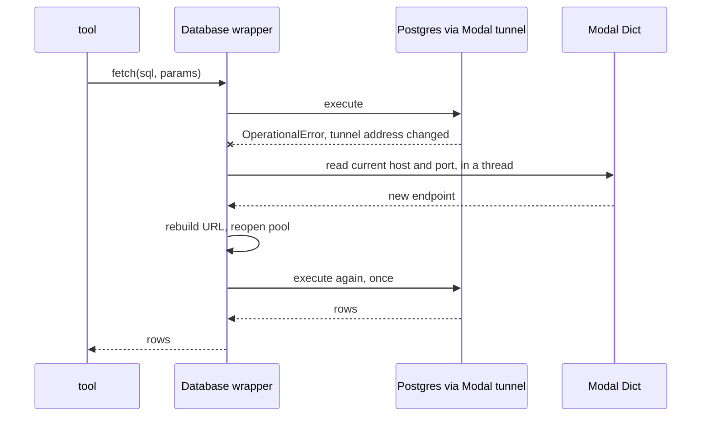
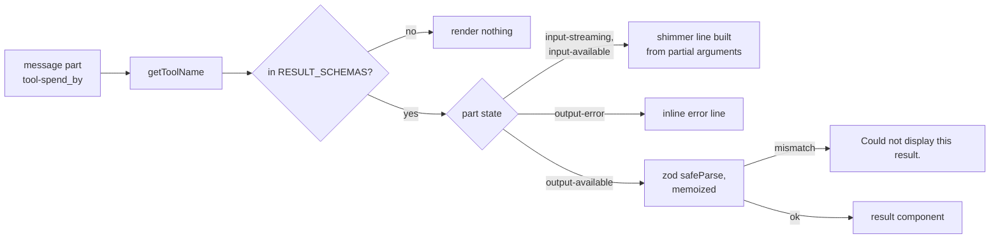
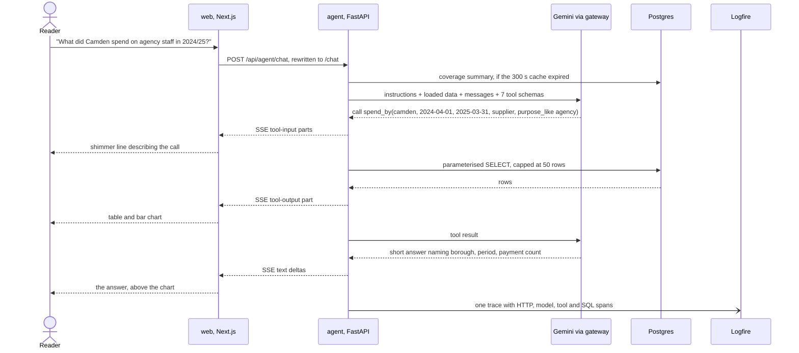
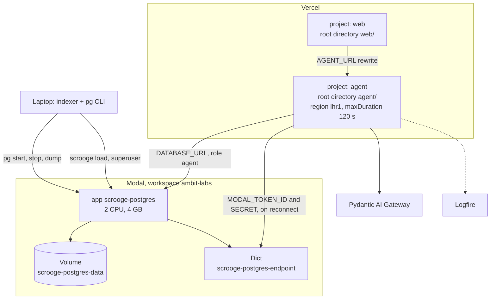

# Scrooge architecture

How the four projects in this repo fit together, what each one is built with, and
what happens between a borough publishing a CSV and a reader getting an answer
with a chart under it.

Written 2026-09-19 against the working tree. The result cards and the "Show tool
calls" setting in `web/` were uncommitted at the time, so check `git log` if
something here no longer matches.

## The short version

Scrooge has two halves that only meet in Postgres.

The write half runs on a laptop. The `scrooge` CLI downloads each borough's
spending files byte for byte, then a loader parses them into one `payments`
table. The read half is a chat. A Next.js app streams questions to a Pydantic AI
agent, and the agent answers by calling seven fixed SQL tools against that
table. The model never writes SQL.

## Technologies

| Project | Language and runtime | Main libraries | Tooling |
| --- | --- | --- | --- |
| `indexer/` | Python 3.12 | httpx, BeautifulSoup, openpyxl, Pydantic, psycopg 3, rich, argparse | uv, pytest, ruff |
| `infra/` | Python 3.12 | Modal 1.x, psycopg 3, rich | uv, pytest, ruff |
| `agent/` | Python 3.12 | pydantic-ai-slim 2.46 with the `google` and `ui` extras, FastAPI, uvicorn, psycopg 3 async pool, Logfire, Modal client | uv, pytest with pytest-asyncio, Docker for the test database |
| `web/` | TypeScript, React 19.2, Next.js 16.3 | AI SDK 7 (`ai`, `@ai-sdk/react`), Tailwind 4, shadcn, vendored AI Elements, Recharts 3.8, zod | Bun 1.4, oxlint, oxfmt |

Hosted services: Modal runs Postgres, Vercel hosts `web/` and `agent/` as two
projects, the Pydantic AI Gateway routes model calls to Gemini, Logfire collects
traces.

Each directory is its own project with its own lockfile. Nothing imports across
directories. The only shared file is `docs/payments-schema.sql`, which the
indexer applies, the agent's tests apply, and `agent/tools.py` is written
against.

## Ingest: from borough website to disk

`scrooge download` never parses anything. It keeps the bytes the council
published so a parsing bug can be fixed later without downloading again.

One source is one Python file under `indexer/src/scrooge_indexer/boroughs/`.
Each file subclasses `Source` from `base.py`, sets `slug`, `kind`, `name`,
`threshold`, `access` and `landing_page`, and implements `discover()`, which
returns the list of remote files. The registry in `boroughs/__init__.py` walks
the package with `pkgutil`, so a new borough needs no registration. A module
that fails to import shows up in `import_errors()` and the rest still load.

How a source finds its files depends on the council:

| `access` value | Used by | How it works |
| --- | --- | --- |
| `scrape` | most boroughs | `extract_links()` pulls file links out of the landing page HTML |
| `datapress-api` | Barnet, Brent, London Datastore | CKAN `package_show` |
| `socrata-api` | Camden | Socrata open data API |
| `url-pattern` | Richmond, Wandsworth | URLs built from the period |
| `govuk-content-api` | MHCLG | GOV.UK content API |
| `moderngov-api` | four budget book sources | ModernGov committee documents |

There are 15 spend sources and 12 budget sources. Five boroughs sit behind
Cloudflare or AWS WAF challenges and are left alone on purpose. The research
for all 33 is in `docs/research/`.

The manifest is saved after every file, so Ctrl-C loses at most the file in
flight, and the CLI prints the command that resumes. Files a council edits in
place are marked `mutable` and re-requested with `If-None-Match` and
`If-Modified-Since`. The indexer also hashes them, because some council servers
ignore conditional headers.

Spend files land in `data/raw/<slug>/` and budget files in
`data/budgets/<slug>/`, named `<period>__<safe-name>`. At the time of writing
that is 2.9 GB and 38 MB. `data/` is gitignored.

## Load: from disk to Postgres

`scrooge load` is where normalisation happens. The code is in
`indexer/src/scrooge_indexer/loader/`.

| Module | Job |
| --- | --- |
| `files.py` | finds the spend files on disk for the chosen boroughs and periods |
| `readers.py` | opens CSV and XLSX, tries UTF-8 then cp1252, finds the header row |
| `mappings.py` | maps each borough's column names to the canonical ones in `docs/payments-schema.md` |
| `values.py`, `rows.py` | strict date and amount parsing, builds typed rows |
| `db.py` | the transaction per file and the binary COPY |
| `runner.py` | loops over files, decides skip or load, drives the progress bar |

Each file is one transaction. It deletes any rows already loaded from that
`source_file`, writes the `source_files` row, streams the new rows with
`COPY payments (...) FROM STDIN (FORMAT BINARY)`, then records the outcome. The
path of the source file is the idempotency key, so loading a file twice gives
the same rows, and `UNIQUE (source_file, source_row)` backs that up. Files
already `loaded` or `skipped` are passed over unless `--force`. Files marked
`failed` are retried on the next run.

`scrooge load-status` reads the `source_files` table, and `--problems` lists the
files that were skipped or failed along with the reason.

`scrooge db init` applies `docs/payments-schema.sql` when the `payments` table
is missing, upserts all 33 boroughs with their populations, and grants the
`scrooge_reader` role.

## The payments schema

`raw` keeps the original row as JSON, so every figure the agent reports can be
traced back to a line in a council's file.

`supplier_norm` is a generated column, which is why the supplier tools can match
"CAPITA BUSINESS SERVICES LTD" and "Capita Business Services Limited" as one
supplier. Trigram GIN indexes on `supplier_norm`, `purpose` and the department
expression make the `ILIKE` filters usable on the full dataset. A
`(borough, payment_date)` index serves the period filters that every tool
applies.

The `coverage` view groups payments by borough and month. The agent reads it to
tell the reader what is loaded before it answers, and again when a question
falls outside that range.

Reads go through `scrooge_reader`, a `NOLOGIN` role with `SELECT` on the three
tables and the view and `statement_timeout = '10s'`. The agent logs in as
`agent`, a member of that role. A role does not inherit another role's
`ALTER ROLE ... SET` values, so `agent` needs its own `statement_timeout`. That
gotcha is written up in `docs/payments-schema.md`.

## Postgres on Modal

Modal has no managed database, so `infra/` runs the official `postgres:17` image
as a normal process inside a Modal Function. The design follows from two facts
about Modal. Volumes do not suit a live Postgres heap, and a forwarded TCP port
gets a new address on every container start.

`PGDATA` lives on the container's own disk and the Volume holds only gzipped
`pg_dumpall` archives. A container that dies without its final dump loses up to
one dump interval of writes. For this project that is acceptable, because the
loader can rebuild the database from `data/raw/`.

The tunnel is a public TCP port. `pg_hba.conf` requires `scram-sha-256` for
every non-local address and the superuser password comes from the Modal Secret
`scrooge-postgres`.

The container bills for 2 CPUs and 4 GB for every second it is up, whether or
not anyone queries it. `pg stop` at the end of the day is part of the workflow.

The `pg` verbs are `deploy`, `start`, `stop`, `status`, `url`, `psql`, `dump`
and `restore`. `restore` drops and recreates everything, so it asks for `--yes`.

## The agent

`agent/main.py` exposes a FastAPI app with two routes.

| Route | What it does |
| --- | --- |
| `POST /chat` | takes the AI SDK request body, runs the agent, streams the AI SDK 7 UI message stream back as server-sent events |
| `GET /health` | reports status, the model string, and whether `DATABASE_URL` is set |

`ScroogeAdapter` subclasses Pydantic AI's `VercelAIAdapter`. It translates AI
SDK messages into a Pydantic AI run and the run's events back into stream
parts, so the web app needs no custom protocol code.

### Model selection

`build_model()` in `agent/agent.py` reads `AGENT_MODEL`. The default is
`gateway/google-cloud:gemini-3.6-flash`, which goes through the Pydantic AI
Gateway and needs `PYDANTIC_AI_GATEWAY_API_KEY`. A string starting with
`google:` talks to Google AI Studio with `GOOGLE_AI_STUDIO_KEY` and skips the
gateway. `test` selects Pydantic AI's fake model, which is what the test suite
uses. No test calls a real model.

### Instructions

The static instructions tell the model to answer only from tool results and
never estimate. Every answer states the borough, the period and the payment
count behind a figure, and names the department or purpose values a filter
matched. Prose stays short, because the UI draws the table and the chart.

The last section of the static text is the voice. After the facts the model
may add one dry aside per answer, a weary civil servant's remark about
paperwork, committees or procurement. The section says the accuracy rules
outrank it, and it sits after them because a fast model follows whichever
instruction is more vivid. The aside never targets a named borough, supplier
or person, never hints at waste or wrongdoing, and never rides on a coverage
caveat. It is dropped when the data does not cover the question, when a tool
failed, when the question is out of scope, and when the subject is social
care, children or homelessness. `test_the_voice_never_outranks_the_facts`
pins the order and the limits.

A second, dynamic instruction appends a summary of what is loaded, read from
the `coverage` view and cached for 300 seconds. That is how the model knows
which boroughs and months it can answer for without spending a tool call to
find out.

### Tools

All seven are in `agent/tools.py`. Every statement is fixed and parameterised.
The model picks a tool and fills in arguments, and that is all the control it
has over the SQL.

| Tool | Answers | Reads |
| --- | --- | --- |
| `coverage` | what is loaded, per borough and month | `coverage` view |
| `spend_total` | total and count for a borough and period, with optional department and purpose filters | `payments` |
| `spend_by` | the same, grouped by department, purpose, supplier, month or financial year | `payments` |
| `supplier_payments` | what one supplier was paid, across boroughs | `payments` |
| `largest_payments` | the biggest payments in a period | `payments` |
| `search_payments` | substring search across supplier, purpose and department | `payments` |
| `compare_boroughs` | totals per borough with a per-resident figure | `payments` joined to `boroughs.population` |

The guardrails:

- `ROW_LIMIT = 50` caps every row-returning tool, whatever `limit` the model
  asks for.
- `MATCH_LIMIT = 20` caps the list of matched department and purpose labels.
- A blank borough, an empty borough list, or a filter that normalises to
  nothing raises `ModelRetry`, so the model gets the error back and tries again
  without touching the database.
- `UsageLimits(request_limit=12)` stops a run after 12 model requests. The API
  swaps the library's error for a message that tells the reader how to narrow
  the question.
- The database role enforces read-only access and the 10 second timeout. The
  agent code holds no write statement at all.

### Database access and reconnect

`agent/db.py` wraps a `psycopg_pool.AsyncConnectionPool` with 1 to 4
connections that opens lazily. Because the Modal tunnel address changes on
every restart, a stored `DATABASE_URL` goes stale. On `OperationalError` the
wrapper reads the current host and port from the Modal Dict, rebuilds the URL
with the same user, password and database, reopens the pool and retries once.
The Modal lookup blocks, so it runs in a thread. `QueryCanceled` is the role's
statement timeout firing, and that is re-raised without a reconnect.

### Observability

`agent/observability.py` configures Logfire with
`send_to_logfire="if-token-present"`, so without `LOGFIRE_TOKEN` it does
nothing. With a token it instruments Pydantic AI, FastAPI and psycopg. One chat
request becomes one trace holding the HTTP span, each model request, each tool
call with its arguments and result, and each SQL statement. Prompt and result
content is included, which is fine here because the data is public.

## The web app

`web/src/app/page.tsx` renders a header and the `Chat` component.
`web/src/components/chat/chat.tsx` uses `useChat` from `@ai-sdk/react` with a
`DefaultChatTransport` pointed at `CHAT_API_PATH`.

There are two backends, chosen at build time in `web/src/lib/chat-backend.ts`:

- `/api/agent/chat` is the default. A rewrite in `web/next.config.ts` forwards
  `/api/agent/:path*` to `AGENT_URL`, which defaults to
  `http://127.0.0.1:8000`. The browser only ever talks to its own origin, which
  is why the agent has no CORS configuration.
- `/api/chat` is used when `NEXT_PUBLIC_CHAT_BACKEND=ai-sdk`. It is a TypeScript
  route that calls Gemini through `@ai-sdk/google` with three demo tools. It
  knows nothing about borough data and exists as a fallback for UI work.

A third, dev-only path lives at `/chart-probe`. It patches `window.fetch` so the
chat reads a recorded event stream from `chart-probe/stream/recorded.txt` at
60 ms per event. That lets you work on result cards with no agent, no model and
no database.

### Rendering tool results

Tool calls arrive as message parts typed `tool-<name>`, and
`web/src/components/chat/results/index.tsx` is the only place that renders
them.

`web/src/lib/agent-results.ts` holds one zod schema per tool, and each mirrors
the Pydantic result model in `agent/tools.py` field for field. This is the one
contract in the repo that is kept in sync by hand. Change a tool's result shape
in Python and the matching schema has to change too, or the card falls back to
"Could not display this result."

| Tool | Component |
| --- | --- |
| `coverage` | `CoverageResult` |
| `spend_total` | `SpendTotalResult` |
| `spend_by` | `SpendByResult`, a table plus a Recharts bar chart |
| `largest_payments`, `search_payments` | `PaymentsResult` |
| `supplier_payments` | `SupplierPaymentsResult` |
| `compare_boroughs` | `BoroughComparisonResult` |

The parse is memoized on the tool name and output. Recharts keys its internal
store on object identity, and re-parsing on every render sent it into a render
loop.

The header has one setting, "Show tool calls". It is stored in `localStorage`
under `scrooge:show-tool-calls` and toggles the raw tool cards in the chat. It
never leaves the browser.

## One question, end to end

## Deployment

The two Vercel projects deploy from the same repo with different root
directories. The Python runtime finds the app through `[tool.vercel]
entrypoint = "main:app"` in `agent/pyproject.toml`, installs from `uv.lock` and
reads the Python version from `.python-version`. `agent/vercel.json` pins the
function to London and gives it 120 seconds, because an answer can take several
model round trips.

`AGENT_URL` is read when `next.config.ts` is evaluated, so changing it means a
redeploy of `web`.

### Environment variables

| Variable | Read by | Meaning |
| --- | --- | --- |
| `DATABASE_URL` | agent, indexer loader | Postgres URL. The agent uses the `agent` login, the loader a superuser. |
| `AGENT_MODEL` | agent | model string, default `gateway/google-cloud:gemini-3.6-flash` |
| `PYDANTIC_AI_GATEWAY_API_KEY` | agent | required for any `gateway/` model |
| `PYDANTIC_AI_GATEWAY_BASE_URL` | agent | optional gateway override |
| `GOOGLE_AI_STUDIO_KEY` | agent, web | only for `google:` models and for the web `ai-sdk` backend |
| `MODAL_TOKEN_ID`, `MODAL_TOKEN_SECRET` | agent | lets the agent read the endpoint Dict when it reconnects |
| `LOGFIRE_TOKEN` | agent | turns tracing on |
| `AGENT_ENV` | agent | Logfire environment label, default `dev` |
| `AGENT_URL` | web | where the rewrite sends `/api/agent/*` |
| `NEXT_PUBLIC_CHAT_BACKEND` | web | `ai-sdk` switches to the TypeScript fallback route |
| `SCROOGE_PG_PASSWORD` | infra | superuser password for `pg url`, `pg psql`, `pg status` |
| `SCROOGE_PG_DUMP_INTERVAL` | infra | seconds between dumps, default 600 |
| `SCROOGE_TEST_DATABASE_URL` | indexer tests | a disposable Postgres 17 for the loader tests |
| `TEST_DATABASE_URL` | agent tests | skips Docker and uses this database |

## Testing

| Project | Size | What it needs |
| --- | --- | --- |
| `indexer/` | 30 files, 355 tests | nothing for the default suite, which uses `httpx.MockTransport` and `tmp_path`. Loader database tests skip themselves without `SCROOGE_TEST_DATABASE_URL`. |
| `infra/` | 3 files, 45 tests | nothing. Modal is not called. |
| `agent/` | 5 files | Docker. A session fixture starts `postgres:17` on a random port, applies the schema and `tests/seed.sql`, which holds 2 boroughs and 18 payments. |
| `web/` | no tests | `bun run lint` and `bun run format:check` |

All three Python projects run with `uv run pytest -q`.

## Known gaps

- The agent has no authentication. Anyone who learns the agent project's URL
  can post to `/chat` and spend gateway credit. The rewrite in `web/` hides the
  URL from the browser and does nothing else.
- The Postgres tunnel is unencrypted TCP on a public address, guarded by
  `scram-sha-256` and the password.
- The zod schemas in `web/` and the Pydantic models in `agent/` are kept in
  sync by hand.
- Budget files download but nothing loads them. Only spend files reach
  Postgres, so the agent cannot compare spend to budget yet.
- Open data bugs: nine Redbridge rows carry dates up to 2036 and stretch the
  coverage claim (#11), and a "Capita" supplier question can burn all 12
  requests because the substring also matches "capital" (#10).
